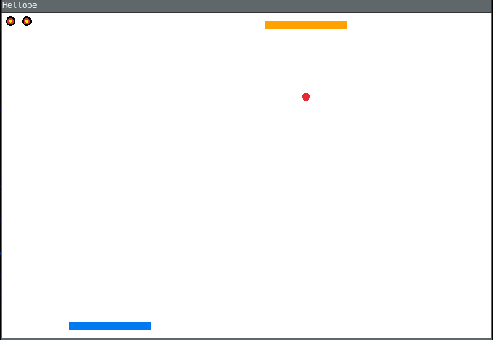
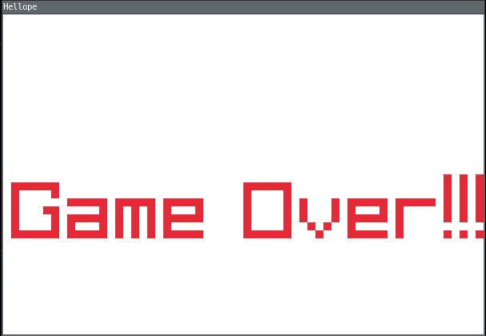

# Odinout
>> Breakout game in odin lang

## Why?
1. First time using odin, so to learn
2. Learning how to use raylib in odin

## Requirements
- Odin lang compiler

## Compiling

```sh
$ git clone git@github.com:hexaredecimal/odinout.git
$ cd odinout
$ odin build .
$ ./odinout
```

## Screenshots




